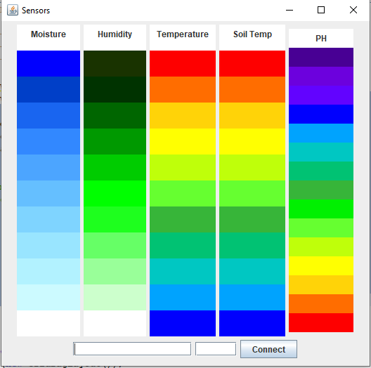

# Sensor-System-Arduino
To develop a data plotter, temparatue, soil moisture, soil temparature, humidity and pH sensors are used with arduino. The system was built for a mars rover, where it will be able to analyze the soil as well as the environment.

